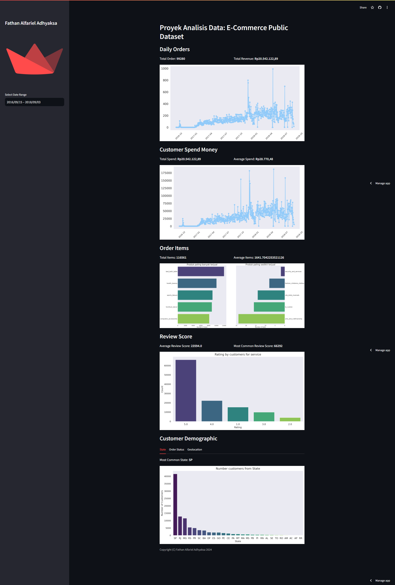

# Submission Dicoding "Belajar Analisis Data dengan Python" ✨

## Struktur Direktori

- **/data**: Direktori ini berisi dataset yang digunakan dalam proses analisis data
- **/dashboard**: Direktori ini berisi main.py yang digunakan untuk membuat dashboard hasil analisis data.
- **notebook.ipynb**: File ini yang digunakan untuk melakukan analisis data.

## Instalasi

1. Clone repository ini ke komputer lokal Anda menggunakan perintah berikut:

   ```shell
   git clone https://github.com/Mazwan98/dicoding.git](https://github.com/FathanAlfariel/proyed-analisis-data-dicoding.git
   ```

2. Pastikan Anda memiliki lingkungan Python yang sesuai dan pustaka-pustaka yang diperlukan. Anda dapat menginstal pustaka-pustaka tersebut dengan menjalankan perintah berikut:

   ```shell
   pip install streamlit
   pip install -r requirements.txt
   ```

## Run steamlit app

1. Masuk ke direktori proyek (Local):

   ```shell
   cd dashboard
   streamlit run main.py
   ```

   Atau bisa dengan kunjungi website ini [Proyek Analisis Data](https://dicoding-09.streamlit.app/)

   </img>
